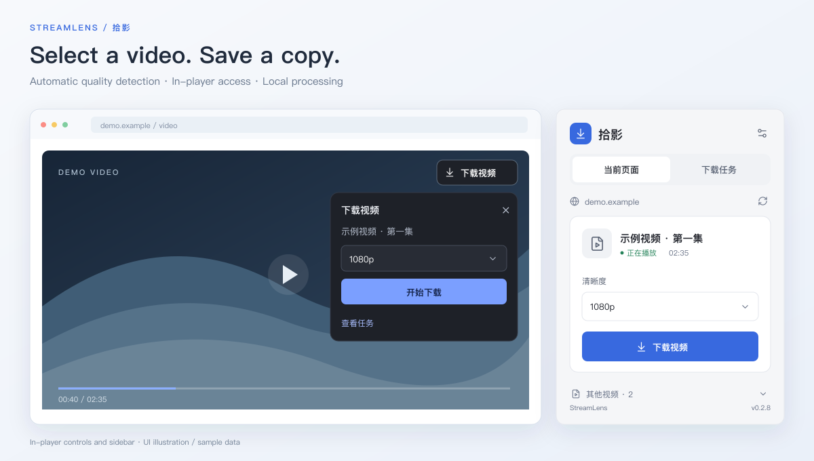
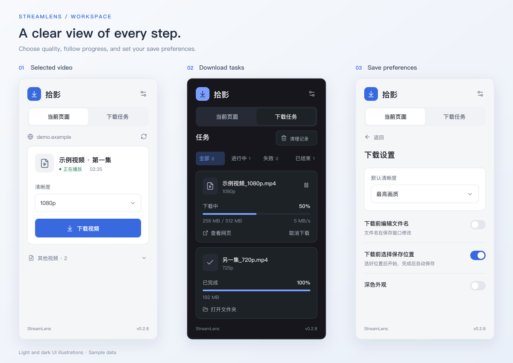

<div align="center">
  
  <h1>StreamLens · 拾影</h1>
  <p><strong>Select a video. Detect its quality. Save a local copy.</strong></p>
  <p>A Chrome video downloader · HLS VOD · Bilibili DASH · Local task management</p>
  <p>
    <a href="https://github.com/lixinqiany/stream-lens/releases/latest"></a>
    <a href="https://github.com/lixinqiany/stream-lens/actions/workflows/ci.yml"></a>
    
    <a href="LICENSE"></a>
  </p>
  <p><a href="README.md">简体中文</a> · <strong>English</strong></p>
  <p>
    <a href="https://github.com/lixinqiany/stream-lens/releases/latest">Download</a> ·
    <a href="#features">Features</a> ·
    <a href="#supported-media">Supported media</a> ·
    <a href="#development">Development</a> ·
    <a href="https://github.com/lixinqiany/stream-lens/discussions">Discussions</a>
  </p>
</div>

<p align="center">
  
  <br>
  <sub>UI illustration · Sample data</sub>
</p>

## Features

| Selection & detection | Downloading & management |
| --- | --- |
| **Select a player** — Click the video or its controls to choose your target. Autoplay elsewhere does not change it. | **In-player access** — Confirm downloads from the video overlay or persistent sidebar. |
| **Automatic quality detection** — Discover available resolutions, apply your preference, or select another quality. | **Choose a location first** — Pick the filename and destination before downloading; save automatically on completion. |
| **Light & dark themes** — Compact cards keep the title, duration, quality and primary action in view. | **Local task queue** — Pause, resume, cancel, retry and filter tasks. Downloads continue after closing the sidebar. |

<p align="center">
  
  <br>
  <sub>UI illustrations based on v0.2.8 with sample data, not browser screenshots. The extension interface is currently in Chinese.</sub>
</p>

## Installation

**Chrome 116+ required.** Install in developer mode; the extension is not yet listed in the Chrome Web Store.

1. Download the ZIP from [Releases](https://github.com/lixinqiany/stream-lens/releases/latest) and extract it to a permanent folder.
2. Open `chrome://extensions`, enable **Developer mode**, select **Load unpacked**, and choose the folder containing `manifest.json`.
3. Pin StreamLens to the toolbar. Open a video page and click its player. Once detection finishes, confirm the quality and select **下载视频** (Download video).

**Updating:** Replace the contents of the original extension folder, reload the extension, then refresh video pages.

**Save location:** Uses Chrome's download folder by default. Enable **下载前选择保存位置** (Choose a save location before downloading) to pick a destination first.

## Supported media

| Source / format | Output |
| --- | --- |
| Direct MP4 / WebM | Original file |
| HLS VOD · TS H.264 / AAC | MP4 remuxing without re-encoding |
| HLS VOD · fMP4 H.264 / AAC | MP4, with consistent initialization data |
| HLS AES-128 identity | Standard AES-CBC segment decryption |
| Bilibili BV / bangumi `ep`, `ss` · H.264 + AAC DASH | Video and audio merged into MP4 |

**Limits:** Two concurrent streaming tasks, up to 8 GB per file. Bilibili quality depends on the playback access available to your account and region.

<details>
<summary><strong>Compatibility and recovery</strong></summary>

- Live streams, DASH on other sites, separate HLS audio, timeline changes and DRM / SAMPLE-AES are not supported. Preview-only content is not offered as a full download.
- Worker-based transmuxing, closed Shadow DOM, custom media elements and shared ad players may prevent source detection.
- Closing the browser interrupts streaming tasks; retries restart from the beginning. Resuming direct downloads to the default folder depends on the server. Direct downloads to a preselected location restart when resumed.
- Automated checks do not replace real Chrome validation of native save dialogs, cross-document file access or website compatibility. See the [validation log](docs/validation.md) (Chinese).

</details>

## Privacy & permissions

Videos are processed locally. History, preferences and temporary files stay on your device: **no telemetry or cloud uploads**. Clearing records does not delete downloaded files.

HTTP/HTTPS permissions are declared at installation to detect players and access video CDNs. Adjust site access in Chrome's extension settings. Download only content you have permission to save. Report security issues through [private vulnerability reporting](https://github.com/lixinqiany/stream-lens/security/advisories/new).

## Development

**Node.js 24.15+**. Build the extension from source:

```sh
git clone https://github.com/lixinqiany/stream-lens.git
cd stream-lens
npm ci
npm run build:extension
```

Load `dist-extension` in Chrome. After changes, rebuild, reload the extension, and refresh the page.

| Command | Purpose |
| --- | --- |
| `npm test` | 93 tests for media parsing, background logic and download runners |
| `npm run test:ui` | Component, player and save-recovery checks in jsdom; no browser is launched |
| `npm run dev` | Early design prototype with demonstration data |

[Architecture](docs/architecture.md) · [Design](docs/product-design.md) · [References](docs/research.md) · [Contributing](CONTRIBUTING.md) — detailed guides are currently in Chinese.

## Community & license

[Report a bug](https://github.com/lixinqiany/stream-lens/issues), [discuss an idea](https://github.com/lixinqiany/stream-lens/discussions), or open a pull request. Remove cookies, tokens and signed media URLs from reports.

[MIT](LICENSE) © lixinqiany. Dependencies retain their own licenses; release packages include `THIRD-PARTY-NOTICES.txt`. Test media consists of generated color patterns and audio, with no downloaded website videos.
