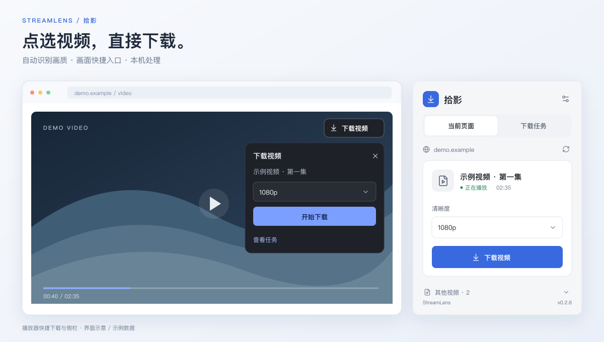
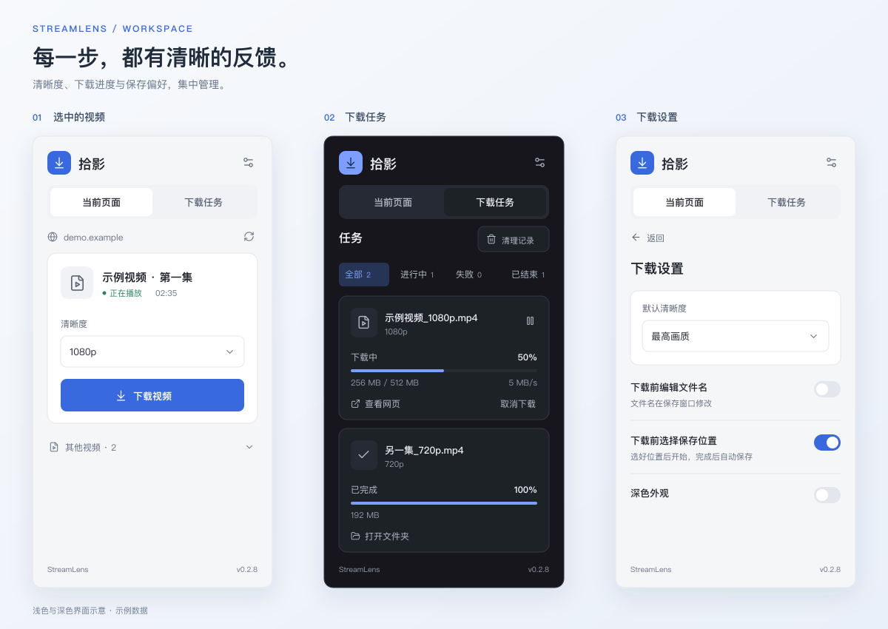

<div align="center">
  
  <h1>拾影 StreamLens</h1>
  <p><strong>喜欢的视频，值得留下。</strong></p>
  <p>网页视频下载 · 自动识别 · 自选画质 · 边下边存</p>
  <p>
    <a href="https://github.com/lixinqiany/stream-lens/releases/latest"></a>
    <a href="https://github.com/lixinqiany/stream-lens/actions/workflows/ci.yml"></a>
    
    <a href="LICENSE"></a>
  </p>
  <p><strong>简体中文</strong> · <a href="README.en.md">English</a></p>
  <p>
    <a href="https://github.com/lixinqiany/stream-lens/releases/latest">下载安装</a> ·
    <a href="#功能">功能</a> ·
    <a href="#支持范围">支持范围</a> ·
    <a href="#开发">开发</a> ·
    <a href="https://github.com/lixinqiany/stream-lens/discussions">社区讨论</a>
  </p>
</div>

<p align="center">
  
  <br>
  <sub>界面示意 · 示例数据</sub>
</p>

## 功能

| 选择与识别 | 下载与管理 |
| --- | --- |
| **选中播放器** — 自动识别明确的主播放器；点击视频画面、控件或侧栏列表可切换，手动选择优先。 | **画面快捷下载** — 从播放器右上角或常驻侧栏确认下载。 |
| **自动识别画质** — 自动读取可用清晰度，按偏好预选，也可手动调整。 | **下载前选址** — 提前选择文件名与位置，边下载边写入磁盘。 |
| **深浅两种外观** — 精简卡片呈现标题、时长、画质和主要操作。 | **本地任务队列** — 暂停、继续、取消、重试与筛选，关闭侧栏后继续处理。 |

<p align="center">
  
  <br>
  <sub>基于 v0.2.8 界面绘制的示意图，使用示例数据，并非浏览器实机截图。</sub>
</p>

## 安装

**需要 Chrome 116+。** 当前通过开发者模式安装，尚未上架 Chrome Web Store。

1. 从 [Releases](https://github.com/lixinqiany/stream-lens/releases/latest) 下载 ZIP，解压到固定文件夹。
2. 打开 `chrome://extensions`，开启**开发者模式**，点击**加载已解压的扩展程序**，选择含 `manifest.json` 的文件夹。
3. 将拾影固定到工具栏，打开视频网页，主视频自动识别。识别完成后确认清晰度，点击**选择位置并下载**。

**升级：** 用新包替换原扩展目录内容，重新加载扩展，再刷新视频网页。

**语言：** 默认跟随 Chrome 界面语言，中文使用简体中文，其他语言使用英文。可在设置 → 语言中选择“跟随浏览器 / 简体中文 / English”，切换不影响下载任务。

**保存位置：** 默认先选择文件名和保存位置，再边下载边写入磁盘；完成后提交完整文件，无需二次复制。升级到 v0.2.9 会自动启用此方式。关闭“下载前选择保存位置”后使用 Chrome 下载目录，HLS / DASH 仍需本机临时文件。

## 支持范围

| 视频来源 / 格式 | 下载方式 |
| --- | --- |
| MP4 / WebM 直链 | 保存原文件 |
| HLS 点播 · TS H.264 / AAC | 转封装为 MP4，不重新编码 |
| HLS 点播 · fMP4 H.264 / AAC | 相同初始化信息的分片保存为 MP4 |
| HLS AES-128 identity | 支持普通 AES-CBC 分片解密 |
| YouTube watch / Shorts · 公开的 H.264 + AAC 分段流 | 合并视频与音轨为 MP4 |
| 抖音作品 / 精选页所选作品 | 保存官方分享页提供的完整 MP4 |
| Bilibili BV / 番剧 `ep`、`ss` · H.264 + AAC DASH | 合并视频与音轨为 MP4 |

**下载验证：** 已通过代码和真实 HTTP 请求完整下载 YouTube 19 秒视频、B 站 3 分 32 秒普通投稿，以及抖音 21 分 18 秒作品；三个文件均含音视频，整文件解码无错误。另一个 YouTube 长视频中途被 CDN 拒绝，未计为成功。未操控浏览器，原生 Chrome 安装与保存仍需实机验证。详见 [平台测试](docs/platform-support.md)。

**处理上限：** 同时两个流式任务，单文件最多 8 GB。可用画质取决于平台返回的正常播放权限。YouTube 仅支持可直接获取索引播放流的视频，部分视频会被 CDN 拒绝；抖音保留官方播放文件，可能含水印。

<details>
<summary><strong>兼容性与恢复说明</strong></summary>

- 暂不支持直播、未适配站点 DASH、HLS 独立音轨、时间线切换、DRM / SAMPLE-AES；试看内容不提供完整下载。
- Worker 转封装、封闭 Shadow DOM、自定义媒体元素或共用广告播放器可能影响来源识别。
- 浏览器关闭会中断流式任务，重试从头开始。默认目录直链续传取决于服务器；预选位置的直链暂停后继续会从头读取。
- 自动化检查无法替代真实 Chrome 的原生保存窗口、跨文档写入授权和站点兼容性验收。详见 [验证记录](docs/validation.md)。

</details>

## 隐私与权限

视频在本机处理。任务历史、偏好与临时文件只存本机，**无遥测、无云端上传**。清理记录不会删除已下载的视频文件。

HTTP/HTTPS 站点权限用于识别播放器与访问视频 CDN，随安装声明；可在 Chrome 扩展详情中调整。仅下载你有权保存的内容。安全问题请通过 [私密漏洞报告](https://github.com/lixinqiany/stream-lens/security/advisories/new) 提交。

## 开发

**Node.js 24.15+**。从源码生成正式扩展：

```sh
git clone https://github.com/lixinqiany/stream-lens.git
cd stream-lens
npm ci
npm run build:extension
```

在 Chrome 加载 `dist-extension`。修改后重新构建、重新加载扩展并刷新网页。

| 命令 | 用途 |
| --- | --- |
| `npm test` | 核心解析、后台与执行器回归测试 |
| `npm run test:ui` | 正式组件、播放器及保存恢复检查，使用 jsdom，不启动浏览器 |
| `npm run dev` | 早期设计原型，使用演示数据 |

[架构说明](docs/architecture.md) · [设计说明](docs/product-design.md) · [参考来源](docs/research.md) · [贡献指南](CONTRIBUTING.md)

## 社区与许可

欢迎 [提交问题](https://github.com/lixinqiany/stream-lens/issues)、[讨论想法](https://github.com/lixinqiany/stream-lens/discussions) 和 Pull Request。反馈时请移除 Cookie、令牌与带签名的媒体地址。

[MIT](LICENSE) © lixinqiany。依赖保留各自许可证，安装包附带 `THIRD-PARTY-NOTICES.txt`。测试媒体为人工生成色块与音频，不包含下载的网站视频。
